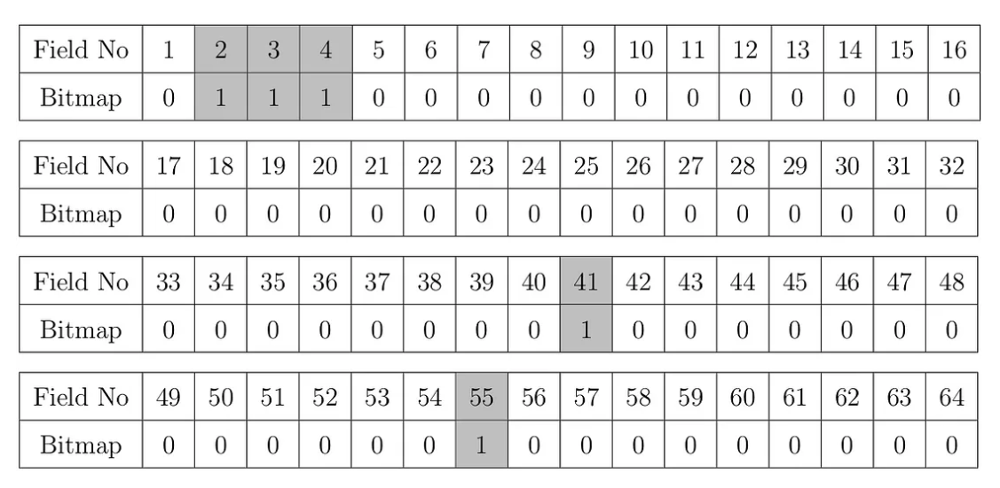

#### Source
https://medium.com/@lalankeba/introduction-to-iso-8583-messages-3dd732437ad7

ISO 8583 messages are used to transfer financial messages over the network. Typically between automated teller machines (ATM) or point of sale (POS) devices and banks transfer information through ISO 8583 messages. To transfer these messages, one can use any network protocol but normally TCP/IP connections are widely used.


ISO 8583 messages can be exchanged in two entities. Above figure shows a situation where an ATM or POS machine sends an ISO 8583 message and the financial institution receives it. Then the data from the ISO 8583 message will be extracted and processed. Financial institution does backend processing such as balance inquiry, credit transfer, cash withdrawal operation according to the information it has. After that, resultant information can be sent as an ISO 8583 message. Resultant message can be successful, declined, etc.

In this article we discuss the structure of the ISO 8583 message.

I will explain the ISO message with simple example here. Suppose we receive the following ISO 8583 message.

```
ISO198702007000000000800200161234567890123456380010000000001234N1742 012CHOW a34 LHR
```

Now let’s break this message into understandable pieces.

#### 1 Message Structure
ISO 8583 message basically has 4 parts.

1. Header
2. Message Type Identifier (MTI)
3. Bitmap
4. Data Fields


ISO 8583 message structure
Simple ISO 8583 message divided into parts

#### 1.1 Header
Header can be any value and it’s not mandatory. But before transmitting the message, all involved parties should agree the length of the header. So the header can be empty too. In this case, header length is 7.

Since the header length is 7 (suppose this was agreed before the transmission), according to the above message, the header would be as follows,


#### 1.2 Message Type Identifier (MTI)
Message type identifier is a 4 digit numeric field which has a hexadecimal value that indicates the type of message. So the MTI is as follows,

MTI of an ISO8583 message

There are various MTIs. Following are the widely used ones in real life.
```
X1XX : Authorization messages
X2XX : Financial messages
X4XX : Reversal messages
X8XX : Network Management messages
```


#### 1.3 Bitmap
Bitmap is a numeric field which indicates the presence of data fields. It contains 16 or 32 characters long hexadecimal value depending on the number of data fields you have in the message. If the bitmap has only 16 characters, it has only primary bitmap. If the bitmap has 32 characters, it has both primary and secondary bitmaps. After converting the hexadecimal value to binary number, each digit indicates whether the corresponding data field is present or not. 1 denotes present and 0 denotes absence.

Please note that, if the bitmap has both primary and secondary bitmaps, first digit (Field number 1) should be 1. You will realize that the above message does not contain secondary bitmap since the field number 1 is 0 here.

primary bitmap of an ISO8583 message

Now let’s convert this hex number to binary. This can be easily done by any online tool. Here I’m using rapidtables.com.


So the final binary number would be,
```bash
0111 0000 0000 0000 0000 0000 0000 0000 0000 0000 1000 0000 0000 0010 0000 0000
```

Above binary representation is the actual bitmap. Following graph shows which data fields are present and which are not, according to the bitmap.

Actual bitmap shows the availability of field values

This means data fields 2, 3, 4, 41 and 55 are present. All other data fields are absent since bitmap values are 0. That means in the data fields section, we have data only for field 2, 3, 4, 41 and 55. Please note that, since the field number 1 is 0 and it means that this message does not contain secondary bitmap.

Normally the data element number has its own purpose. Meanings for the above fields are,

Field 2 : Primary Account Number
Field 3 : Processing code
Field 4 : Transaction Amount
Field 41 : Card Acceptor Terminal Identification
Field 55 : ICC Data

#### 1.4 Data Fields
This section contains the actual information of the transaction. Data fields definitions need to be defined beforehand to correctly parse data.

_data fields part of an ISO8583 message_


According to the data field definition, each data element has its own type, format and length. According to our example we know that only the data fields 2, 3, 4, 41 and 55 are present. Let’s extract the data from our example.


**LLVAR** indicates that length can go up to 99 (LL means 2 digit length). But data definition says it can hold maximum of 19 digits. Actually the value comes with 16 digits. That’s why 16 is appended to the real value.

**FIXED** Numeric indicates that length can go up to the specific limit. If the length of the value does not long enough for the specific length limit, zeros will be appended. If the value is an amount, it’s last two digits show the fraction. So the actual value for the field 4 is 12.34.

**FIXED** Alpha Numeric indicates that the length can go up to specified limit. If the length of the value does not long enough for the specified length limit, value is padded with spaces on the right side. So the actual value of the field 41 is [N1742 ]. (Three spaces are appended on the right side)

**LLLVAR** Alpha Numeric indicates length can go up to 999 (LLL means 3 digit length). Data definition also says it can hold maximum of 999 digits. Actually the value comes with 12 characters. That’s why 012 is appended to the real value.

#### Important Note
As you saw earlier, when you break this ISO 8583 message into understandable pieces, at first glance you cannot say the message has only primary bitmap or both primary and secondary bitmaps. So we need to take the first 16 characters (primary bitmap) and convert it to binary number and check whether the first character (Field number 1) is 1 (present). So then we know the message has secondary bitmap or not. After that we can extract data values according to them.

In the following example we will take a look into an ISO 8583 message which has both primary and secondary bitmaps.

### 2 Real Life Example
To make things clear, let’s create a financial transaction request.

#### 2.1 Creating Data Fields
The items in the value column are the data that need to be sent. Result is the actual value that needs to be sent in ISO 8583 message.

To reduce the space in the following table, we will use following abbreviations.

**Fn** : Field Number
**Len** : Length
**Num** : Numeric
**Alp** : Alpha


Therefore the complete data field can be obtained by concatenating result values. Please note the following points.

Results of the field no 2, 32 and 102 were appended by their respective length values (16, 08 and 15), because the format is LLVAR.

The amount value 780.00 became 000000078000 as the result in field no 4.

Result of the field no 120 was appended by value 021, because the format is LLLVAR.


#### 2.2 Creating Bitmap
Let’s create the bitmap for above data fields now. Since we have data only in fields 2, 3, 4, 7, 11, 12, 13, 14, 15, 18, 22, 25, 26, 28, 30, 32, 37, 41, 42, 43, 49, 102 and 120, let’s create the binary bitmap for it.

Since this message has values for fields 102 and 120, we need more than 16 character long bitmap (16 character long bitmap can only represent 64 data fields). Which means this should have both primary and secondary bitmaps (32 character long bitmap can represent 128 data fields). So the filed number 1 should have the value 1 (present) indicating that it has the secondary bitmap.

It looks like the following.


Therefore following is the resulting bitmap in binary format.
```bash
1111 0010 0011 1110 0100 0100 1101 0101 0000 1000 1110 0000 1000 0000 0000 0000 0000 0000 0000 0000 0000 0000 0000 0000 0000 0100 0000 0000 0000 0001 0000 0000
```

Then the actual bitmap in hexadecimal format can be obtained by converting above binary number to hexadecimal value. This also can be done from the same online tool, www.rapidtables.com


Therefore the actual bitmap would be,


#### 2.3 Creating Message Type Indicator (MTI)
Since this message is a financial transaction request, MTI becomes,


MTI of a financial message
#### 2.4 Creating Header
Suppose we agreed on 7 character long header. So we will send following header,


Header of ISO 8583 message
So our final message becomes,


So the final ISO 8583 message looks like as follows,

ISO8583 financial message
ISO 8583 Financial message